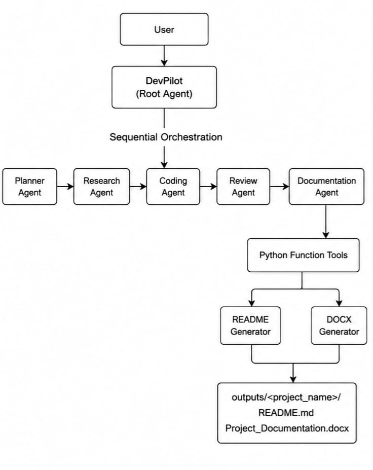
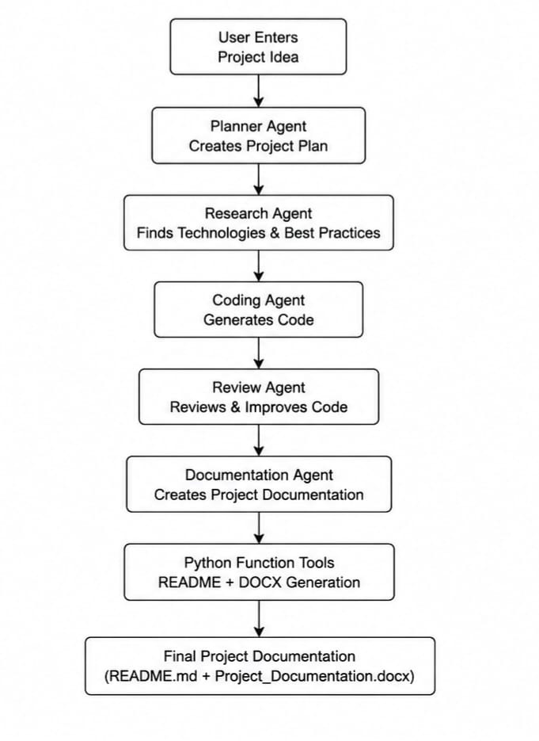
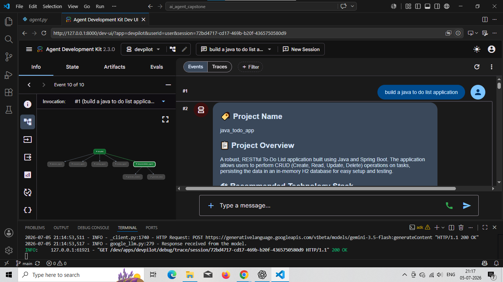
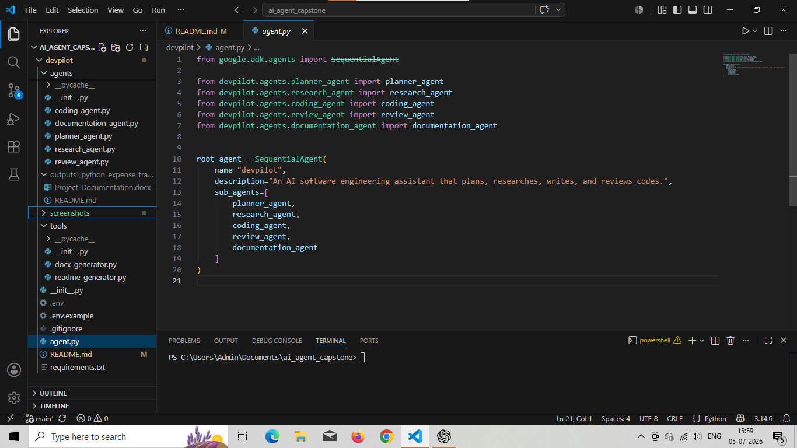
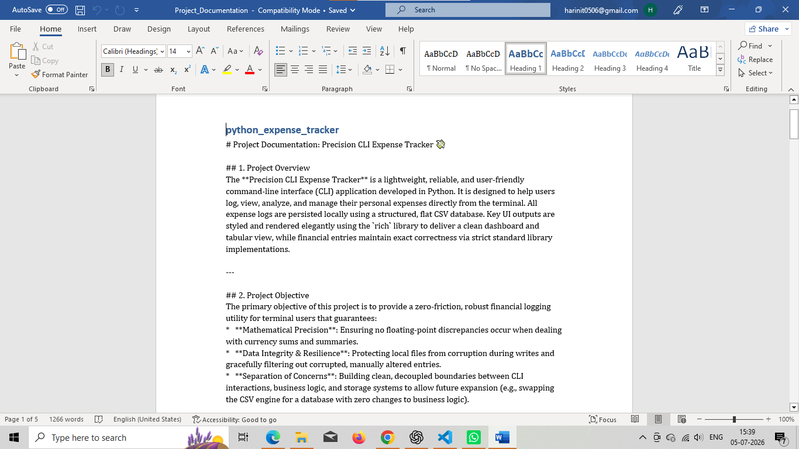
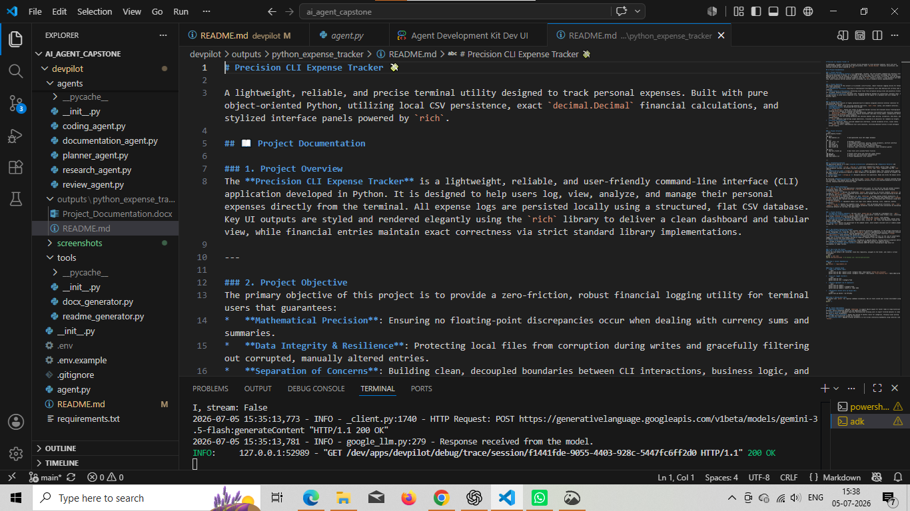

# 🤖 DevPilot – AI Software Engineering Assistant

DevPilot is a multi-agent AI software engineering assistant built using **Google Agent Development Kit (ADK)** and **Gemini**. It automates the software development lifecycle by planning projects, researching technologies, generating production-quality code, reviewing implementations, and creating professional documentation.

Instead of relying on a single AI agent, DevPilot coordinates multiple specialized agents, each responsible for a specific stage of software development, resulting in structured, maintainable, and high-quality project outputs.

---

# ✨ Features

- 📋 Intelligent Project Planning
- 🔍 Technology & Best Practice Research
- 💻 Production-Quality Code Generation
- 🔎 Automated Code Review
- 📖 Professional Project Documentation
- 📝 Automatic README.md Generation
- 📄 Automatic DOCX Documentation Generation
- 🧩 Modular Multi-Agent Architecture
- ⚡ Built using Google ADK

---

# 🏗️ Architecture



---

# 🔄 Workflow



1. User provides a software project idea.
2. Planner Agent creates the project plan.
3. Research Agent recommends technologies and best practices.
4. Coding Agent develops the complete implementation.
5. Review Agent reviews and improves the generated code.
6. Documentation Agent generates professional project documentation.
7. Function tools automatically generate:
   - README.md
   - Project_Documentation.docx

---

# 📂 Project Structure

```
devpilot/
│
├── agents/
│   ├── planner_agent.py
│   ├── research_agent.py
│   ├── coding_agent.py
│   ├── review_agent.py
│   ├── documentation_agent.py
│   └── __init__.py
│
├── tools/
│   ├── readme_generator.py
│   ├── docx_generator.py
│   └── __init__.py
│
├── outputs/
│   └── <generated_project>/
│
├── agent.py
├── requirements.txt
├── .env.example
├── .gitignore
└── README.md
```

---

# 🧠 Multi-Agent System

## 📋 Planner Agent

Creates a structured software development plan including:

- Project objectives
- Functional requirements
- Technology recommendations
- Folder structure
- Development roadmap

---

## 🔍 Research Agent

Performs technical research and recommends:

- Frameworks
- Libraries
- Design patterns
- Best practices
- Industry recommendations

---

## 💻 Coding Agent

Generates production-quality implementation by:

- Following the project plan
- Applying research recommendations
- Producing clean and maintainable code
- Keeping the project structure simple and extensible

---

## 🔎 Review Agent

Reviews the generated implementation by checking:

- Code quality
- Best practices
- Readability
- Maintainability
- Possible improvements

---

## 📖 Documentation Agent

Creates beginner-friendly project documentation explaining:

- Project Overview
- Architecture
- Workflow
- Technologies
- File descriptions
- How to run the project
- Future improvements

It also invokes the documentation tools to generate:

- README.md
- Project_Documentation.docx

---

# 🛠️ Technology Stack

- Python
- Google Agent Development Kit (ADK)
- Google Gemini
- python-docx
- Modular Multi-Agent Architecture

---

# 🚀 Installation

Clone the repository

```bash
git clone https://github.com/<your-username>/devpilot.git
```

Navigate to the project

```bash
cd devpilot
```

Install dependencies

```bash
pip install -r requirements.txt
```

Create a `.env` file

```env
GOOGLE_API_KEY=YOUR_API_KEY
```

Run DevPilot

```bash
adk web
```

---

# 💡 Example Prompt

```
Build a Java To-Do List Application.
```

DevPilot automatically:

- Creates a project plan
- Researches technologies
- Generates production-ready code
- Reviews the implementation
- Generates documentation
- Creates README.md
- Creates Project_Documentation.docx

---

# 📷 Screenshots

Add screenshots here after testing.

- ADK Interface



- Project Structure 



- Generated Documentation



- Generated README.md




---

# 🔮 Future Enhancements

- Streamlit Web Interface
- Downloadable Project ZIP
- PDF Documentation
- GitHub Repository Generator
- UML Diagram Generator
- Docker Support
- Multi-Language Project Generation
- Cloud Deployment

---

# 📜 License

This project is developed for educational and research purposes.

---

# 👩‍💻 Author

**Harini T**

AI Software Engineering Project built using Google ADK.